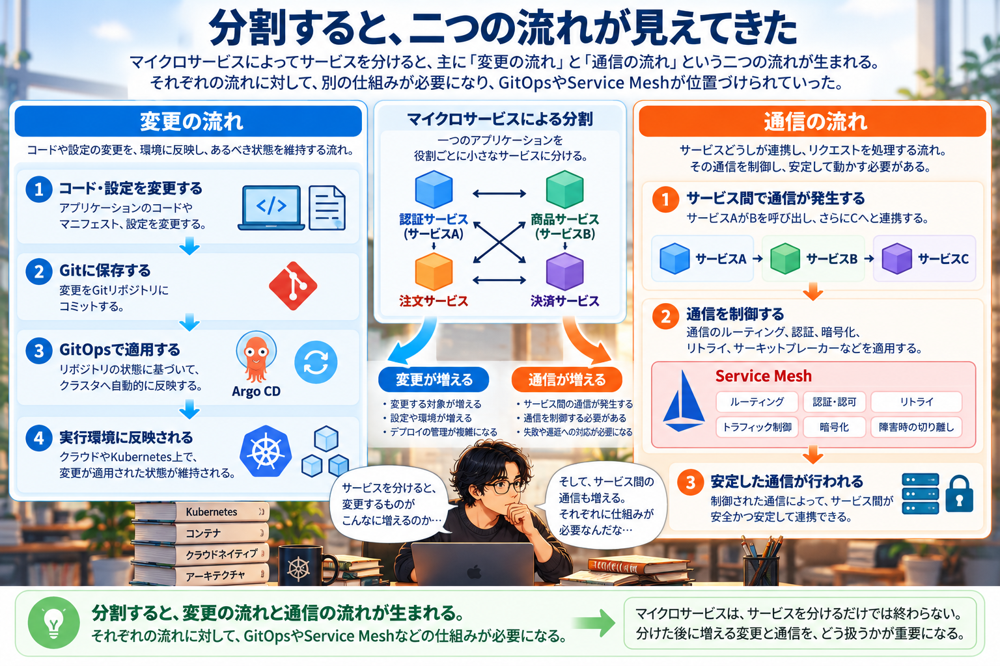
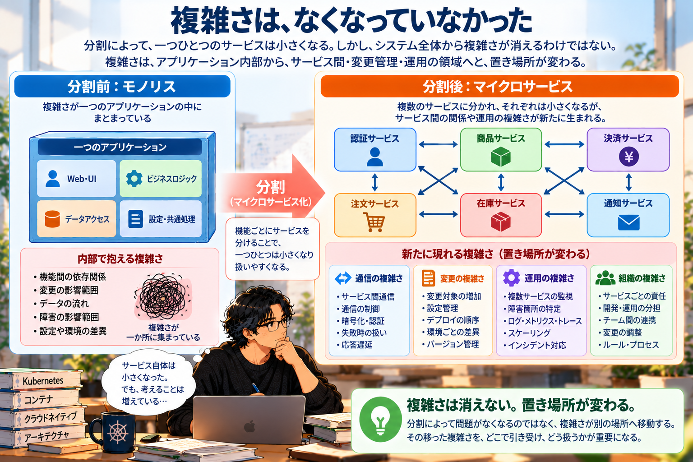
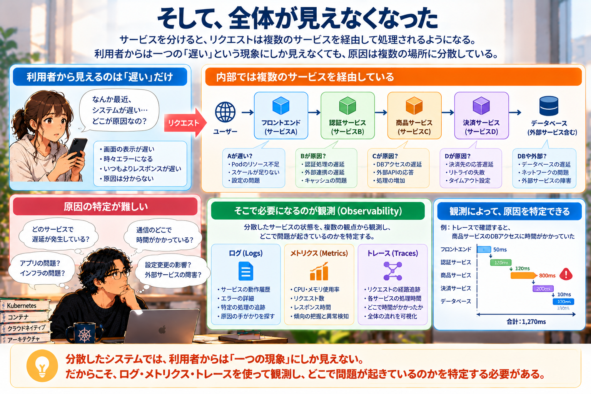
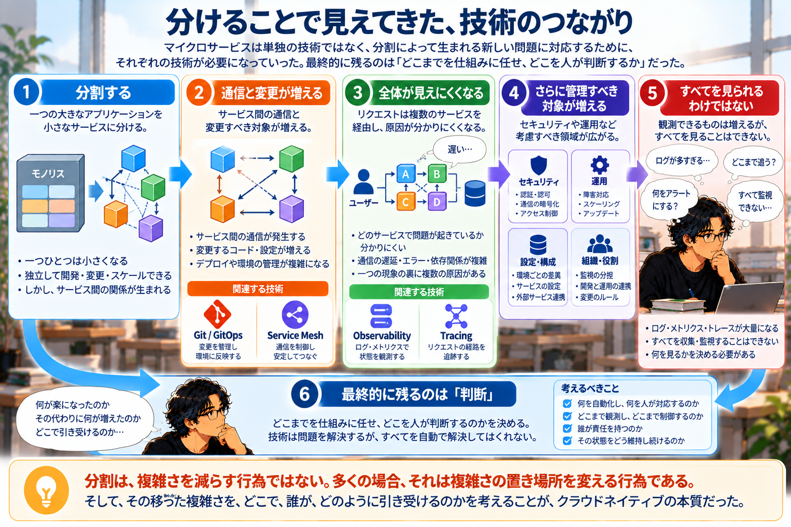

# 分けたら、複雑さがなくなると思っていた

マイクロサービスについて書いていた。一つの大きなアプリケーションを、役割ごとに小さなサービスへ分けていく。  
それぞれを独立して開発し、変更し、必要に応じてスケールできる。

ここまでなら、説明しやすい。

大きなものを小さく分ける。そうすると、一つひとつは扱いやすくなる。  
でも、教科書としてその先を書こうとしたところで、少し困った。

分けたサービスは、どうやって一緒に動くのだろう。

## 分けたら、通信が生まれた

一つだったアプリケーションを複数のサービスへ分ければ、それぞれのサービスは小さくなる。  
ただし、もともと一つの中にあった処理がなくなるわけではない。

サービスAがサービスBを呼び出す。  
サービスBがサービスCへ問い合わせる  
その結果を受け取って、サービスAが利用者へ応答する。

一つのアプリケーションの内部で完結していた処理が、サービス間の通信として外へ出てくる。  
すると、考えなければならないことが増えた。

通信に失敗したらどうするのか。応答が遅かったらどうするのか。どこまで待つのか。もう一度試すのか。  
どのサービスへの通信を許可するのか。通信を暗号化するのか。

サービスを分ける説明を書いていたはずなのに、いつの間にか通信の話になっていた。  
そこで初めて「分ける」という操作には、その後があることが見えてきた。

## 分けたら、変更も増えた

もう一つあった。変更だった。

サービスが一つなら、変更する対象も比較的まとまっている。  
複数のサービスへ分ければ、それぞれを独立して変更できる。

これはマイクロサービスの利点の一つになる。  
でも、独立して変更できるということは、変更する対象が複数存在するということでもある。

サービスAが変わる。サービスBも変わる。設定が変わる。  
デプロイするものが増える。環境ごとの差もある。

誰が、何を、いつ変更したのか。今動いている状態は、本来あるべき状態と一致しているのか。  
ここまで来ると、GitOpsについて書いていた章が、別の話には見えなくなってきた。

GitOpsは「便利なデプロイ方法」として突然登場するのではない。  
分けたことで増えた変更を、どう扱い続けるのか。

そのための仕組みとして見ることができる。  

サービスを分ける。変更する対象が増える。  
だから、変更を管理する仕組みが必要になる。

別々の章として書いていたものが、少しずつ一本につながっていった。

## 二つの流れが見えてきた

このあたりで、教科書の中に二つの流れがあることが見えてきた。

一つは、**変更の流れ**。コードや設定を変更し、その変更を環境へ反映し、あるべき状態を維持する。  
もう一つは、**通信の流れ**。サービスが別のサービスを呼び出し、その通信を制御し、失敗や遅延を扱う。

変更の流れにはGitOpsが関係する。通信の流れにはService Meshのような仕組みが関係する。  
最初から、この二つを並べようとしていたわけではない。

それぞれについて書いていたら、後から同じ構造が見えてきた。  
マイクロサービスによって分けた結果、管理しなければならないものが増えている。

その一つが変更で、もう一つが通信だった。

ここで、最初に考えていた「分ける」という言葉の意味が少し変わった。

## 複雑さは、なくなっていなかった

大きなものを小さく分ければ、一つひとつは単純になる。これは間違っていない。  
ただ、システム全体から複雑さが消えたわけではなかった。

一つのアプリケーション内部にあった関係が、サービス間の通信へ移る。  
一か所にまとまっていた変更が、複数のサービスや設定へ広がる。  
そして、それらを管理するために新しい仕組みが必要になる。

そこで、教科書の中に一つの言葉を置くことになった。

**分割は、複雑さを減らす行為ではありません。多くの場合、それは複雑さの置き場所を変える行為です。**

この言葉が出てきたことで、マイクロサービスの説明だけが変わったわけではなかった。  
その後に書く技術の見え方まで変わった。

Service Meshは、通信を便利にするためだけのものではない。  
GitOpsは、デプロイを自動化するためだけのものでもない。  
分割によって移動した複雑さを、どこで引き受けるのか。

そう考えると、それぞれの技術が置かれている理由が見えやすくなった。

## そして、全体が見えなくなった

ただ、ここでも終わらなかった。

サービスを分ける。通信を制御する。変更を管理する。それでも障害は起きる。  
利用者から「システムが遅い」と言われたとする。

一つのアプリケーションなら、その中を調べればよかったかもしれない。  
でも、リクエストが複数のサービスを通っている場合は違う。

サービスAなのか。サービスBなのか。その先のサービスCなのか。  
ネットワークなのか。外部サービスなのか。

利用者から見えるのは、一つの「遅い」という現象だけだ。  

内部では、それが複数の場所に分散している。

ここで第4部に書いていたObservabilityやTracingが、第3部とは別の運用技術ではなくなった。  
分けた結果、全体が見えにくくなった。だから観測する必要がある。

一つのリクエストがどこを通ったのか追跡する必要がある。

- マイクロサービス
- GitOps
- Service Mesh
- Observability
- Tracing

目次では別々の項目として並んでいたものが、教科書を書いていくうちに因果関係としてつながっていった。

## 全部を見ればいい、にもならなかった

ところが、Observabilityについて書き始めるとまた同じようなことが起きた。  
見えなくなったのであれば、全部見ればいい。

最初はそう考えられる。

でも、サービスが増えればログも増える。メトリクスも増える。Traceも増える。アラートも増える。  
すべてを集め、すべてを見続けることはできない。

今度は「何を見るのか」を決めなければならなくなった。

Tracingも同じだった。  

すべての通信を細かく追跡すれば、それだけデータが増える。  
保存する場所も必要になる。処理にも影響する。

セキュリティについて考えれば、すべてを禁止すれば安全になるわけでもない。  
必要な操作までできなくなる。

結局、どこを見るのか。どこまで追うのか。どこまで許可するのか。  
どこまでを人間が扱い、どこからを仕組みに任せるのか。

技術について書いていたはずなのに、最後に残るのは判断だった。

## 技術の名前を覚える本ではなくなっていった

教科書を書き始めたころから、Kubernetesの操作方法だけを書くつもりではなかった。  
それでも、ここまで一つにつながるとは思っていなかった。

マイクロサービスを説明する。GitOpsを説明する。Service Meshを説明する。
Observabilityを説明する。

それぞれについて正しい説明を書くことはできる。でも、それだけなら「なぜ次にこの技術が出てくるのか」は見えにくい。  
教科書を書きながら何度も前へ戻ったのは、その間をつなぐものを探していたからだったのだと思う。

なぜ分けるのか。分けると何が起きるのか。そこで生まれた問題を、どこで引き受けるのか。  
その仕組みを入れたことで、今度は何が起きるのか。

そうやって追っていくと、技術の名前よりも、その技術が必要になった理由の方が重要になっていった。

## 複雑さをなくすのではなく、どこで引き受けるか

クラウドネイティブについて教えるとき、たくさんの技術が出てくる。

- コンテナ
- Kubernetes
- マイクロサービス
- GitOps
- Service Mesh
- Observability
- Tracing

一つずつ覚えようとすると、それぞれが別の技術に見える。  
でも、教科書を書くためにその間をつないでいくと、少し違う景色が見えた。

ある問題を解決するために構造を変える。構造を変えれば、新しい問題が生まれる。  
その問題を別の仕組みで引き受ける。すると、また別の場所を考える必要が出てくる。

複雑さは、魔法のようになくならない。形を変えたり、場所を変えたりしながら残り続ける。

だから大切なのは「この技術を使えば解決する」で終わることではないのだと思う。

何が楽になったのか。その代わりに何が増えたのか。増えたものをどこで引き受けるのか。  
そして、その状態をどうやって見続けるのか。

教科書を書き始めたとき、自分はクラウドネイティブを説明しようとしていた。  
書き進めていくうちに考えるようになったのは、技術そのものよりもこうした関係だった。

分ければ、単純になると思っていた。確かに、一つひとつは単純になった。  
ただ、その代わりに生まれたものがあった。

それを追いかけていったことで、別々に見えていた技術が、ようやく一つの構造として見えるようになった。
