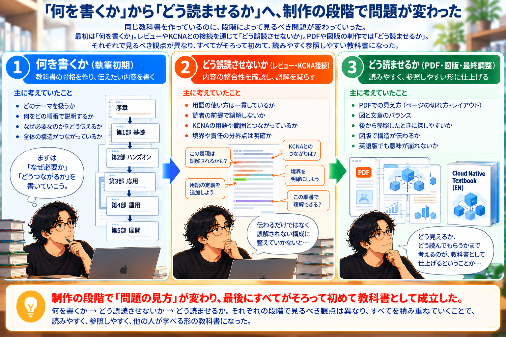
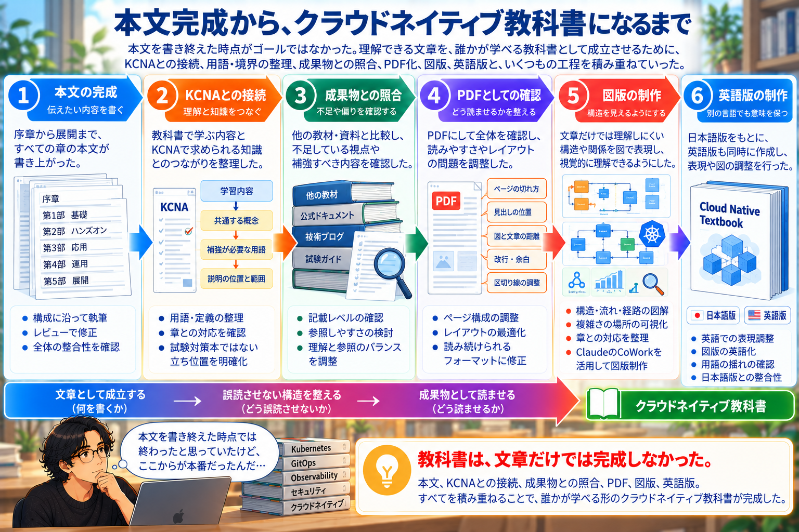

# 本文を書き終えても、教科書は完成しなかった

教科書の本文を書き終えたとき、一つの区切りには来たと思った。

序章から始まり、基礎、ハンズオン、マイクロサービス、GitOps、通信制御、Observability、セキュリティ、  
そしてクラウドネイティブを社会やビジネスへ広げて考えるところまで。

最初に作った目次にあったものは、ほぼ文章になっていた。

何度もレビューを受けた。前の章へ戻って書き直した。説明を削った。  
逆に、足りないところには説明を追加した。

教科書として伝えたかったことも、かなり形になっていた。

だから「本文はできた」とは言えるところまで来ていた。  
でも、「教科書ができた」とは、まだ言えなかった。

ここから先に残っていたのは、文章を書くのとは少し違う仕事だった。

## KCNAとつなげてみる

本文を書き終えたあと、KCNAとの接続を考えることになった。

クラウドネイティブの入門資格として、教科書で学んだこととKCNAで扱われる知識をどうつなぐのか。  
最初に考えたのは、KCNAの試験範囲を教科書へ追加していくことではなかった。

この教科書は、KCNAの試験対策本として作ったものではない。  
それまで作ってきた構造を壊して、試験項目の順番に並べ直すつもりもなかった。

そこで見たのは、**教科書では理解できているのに、KCNAで使われる言葉とつながっていないところはないか**  ということだった。

教科書では、ある技術がなぜ必要なのかを説明している。  
その技術が、前後の技術とどうつながっているのかも説明している。

ところが資格試験では、それとは別に、その技術の名称や役割、分類を知っている必要がある。  
そこで初めて、**理解することと、知識を参照できることは、同じではない**という問題が見えてきた。

## 資格の説明も、順番だけでは足りなかった

KCNAとの接続を考える中で、CKA、CKAD、CKSについても整理した。  
最初は、資格を順番として見ることもできる。

KCNAがあって、その先にCKAやCKAD、CKSがある。でも、それだけでは少し違った。

CKAは、Kubernetesクラスタを運用する側から見る。  
CKADは、その上で動くアプリケーションを作る側から見る。  
CKSは、そこへセキュリティという観点を加える。

単純に、「初級の次は中級、その次は上級」という話ではない。  
**どこに責任を持つのかによって、見る場所が変わる。**  
そう整理すると、この教科書で扱ってきたことともつながった。

資格のために新しい考え方を持ち込んだというより、それまで本文で扱ってきた構造を資格という別の地図から見直していった。

## 「分かる」と「探せる」は違った

KCNAとの接続を考えたことで、本文そのものにも別の問題が見えてきた。
最初から順番に読めば分かる。

でも「Serviceとは何だったか」「Ingressはどこで説明していたか」  
「この用語はKubernetes固有なのか、それとも一般的な言葉なのか」  
と後から確認しようとすると、必ずしも探しやすいとは限らない。

ここで必要になったのが、定義や用語、境界の整理だった。  
ただし、用語集のような本に作り替えたかったわけではない。

この教科書では、それまでずっと、「なぜ必要なのか」「どうつながっているのか」
を中心に書いてきた。

それを捨てて、「○○とは△△である」という説明ばかりにしてしまえば、別の本になる。

だから、元の構造は残した。その上で、必要なところに定義を置く。用語をそろえる。  
どこまでがこの章の話なのかを明確にする。後から戻ってきたときにも、探せるようにする。

そうしたものを少しずつ足していった。

**自分たちが伝えたいことを削って、別の教科書に合わせたわけではなかった。**  
伝えたいことを残したまま、教科書として迷いにくくするための構造を足していった。

## 成果物と照らしてみる

本文だけを見ていると、気づきにくいこともあった。  
そこで、作ってきたものを他の成果物と照らしてみた。

何が書かれているのか。どのくらい用語が定義されているのか。  
どこまで具体的に説明しているのか。後から調べるときに、どこから入れるのか。

ここでも、同じものを作ろうとはしなかった。比較して分かったのは、足りない技術の名前だけではなかった。  
むしろ、**自分たちの教科書が、何を優先して作られているのか**の方だった。

この教科書では、技術を一つずつ独立して覚えるより、その技術が必要になった理由や前後の技術との関係を理解することを優先していた。  
それ自体を変える必要はなかった。

ただ、それだけでは教科書として使うときに不便なところがある。  
理解するための流れと、後から参照するための構造。

両方が必要だった。

## PDFにしたら、別の問題が出てきた

文章がかなり固まったあと、PDFとして確認するようになった。  
すると、それまでとは違う問題が見えるようになった。

Markdownのファイルとして読んでいたときには、それほど気にならなかった。

でもPDFにすると、ページの途中で説明が切れる。見出しだけが次のページへ行く。  
文章が続きすぎて、どこを読んでいるのか分かりにくい。

区切りとして入れていた線が、PDFでは逆に読みづらさを作る。

そうしたことが見えてきた。

文章そのものは変わっていない。内容も間違っていない。  
それでも、成果物として見ると読みづらい。

ここまで来ると、考えることが変わっていた。

最初は、**何を書くか。** を考えていた。  
レビューが進むと、**どう誤読させないか。** を考えるようになった。  
そしてPDFになったころには、**どう読ませるか。** を考えていた。

同じ教科書を作っているのに、制作の段階によって問題そのものが変わっていった。

## 文章だけでは伝わりにくいところが残った

PDFとして全体を見るようになると、もう一つ気になることが出てきた。  
文章だけでは、理解するのに負荷が高いところがある。

特に、複数の要素の関係。処理の流れ。通信の経路。責任の境界。
複雑さがどこへ移動したのか。

そういうものだった。

文章で説明できないわけではない。実際、それまで文章だけで説明していた。  
でも、文章を何段落も読んで頭の中で組み立てなければならないものを、一枚の図で確認できるなら、その方がよいところもある。

そこで図版を入れることになった。ただ、図を増やせばいいわけでもなかった。  
装飾として図を入れるのではなく、**文章だけでは頭の中で組み立てにくい構造を、図で見えるようにする。**

そのために、どこへ図を入れるのかを一つずつ選んだ。

マイクロサービスへ分割すると、複雑さはどこへ行くのか。GitOpsでは、変更がどう流れるのか。  
通信制御は、どこで行われるのか。分散したシステムでは、なぜ全体が見えにくくなるのか。  
一つのリクエストを、どう追跡するのか。

図を作ってみると、文章で作ってきた構造が、そのまま別の形でも成立することが確認できた。  
これは少し意外だった。図を作ったことで教科書の構造が大きく変わったわけではない。

むしろ、**文章で作ってきた構造が、図にしても同じ構造として見えた。**

## 日本語版ができたあと、英語版も作った

日本語版がかなり完成に近づいたあと、英語版の制作も進めた。  
ここでも、単純に日本語を英語へ置き換えれば終わりではなかった。

技術用語そのものは英語が多い。

Kubernetesも、Deploymentも、Serviceも、GitOpsも、Observabilityも、そのまま使える。

でも、文章として説明している部分はそうはいかない。日本語では自然でも、英語にすると説明が長くなる。  
図の中に入れていた文章が枠からはみ出す。同じ言葉を使っているつもりでも、英語では意味の範囲が少し違って見える。

そこでまた、何を残すのか。どこで改行するのか。どの表現なら同じ意味になるのか。  
一つずつ確認していった。

日本語版を作ったときとは違う形で、もう一度教科書を読み直すことになった。

## 本文を書き終えたあとも、かなり長かった

振り返ると、本文ができた時点では、かなり終わった気になっていた。

でも実際には、そのあとにも、KCNAとの接続があった。用語や境界の整理があった。  
成果物との照合があった。PDFでの確認があった。図版制作があった。  
英語版の制作があった。

本文を書くことは、教科書制作の中心だった。  
でも、それだけが教科書を作る仕事ではなかった。

文章として成立する。内容として成立する。教えるものとして成立する。  
後から参照できる。PDFとして読める。図でも理解できる。

別の言語でも意味が崩れない。

一つずつ条件を満たしていった結果として、ようやく「クラウドネイティブ教科書」という一つの成果物になっていった。

## 最初の問いに戻ってきた

この教科書を作り始めたころ、自分は、「クラウドネイティブって何だろう」というところから始めていた。

Kubernetesなら説明できた。コンテナも説明できた。PodやDeploymentやServiceも説明できた。  
でも「では、クラウドネイティブとは何ですか」と聞かれると、うまく説明できなかった。

そこから目次を作った。一度書くのを止めて、構造を考え直した。  
レビューで、自分には見えていて読者には見えていないものを指摘された。  
マイクロサービスを書いて、分ければ単純になるわけではないことを考えた。  
Observabilityを書いて、見えなければ制御できないことを考えた。  
AIを使って、生成することと判断することは違うと気づいた。  
本文を書き終えてからも、教科書として成立させるための作業が続いた。

約10か月。

最初に想像していたより、ずいぶん遠くまで来た。ただ、最後に何か一つの完璧な答えを手に入れた、という感じでもない。  
今なら、最初よりずっと多くのことを説明できる。同時に、簡単な一言では説明できない理由も、以前より分かる。

教科書を書く前は、「クラウドネイティブとは何か」を説明しようとしていた。  
教科書を書き終えた今は、その問いを考えるために、どこを見ればよいのか。
何と何がつながっているのか。どこで判断が必要になるのか。

そういうものを、以前より見られるようになった気がする。

そして、それを自分だけが分かる状態ではなく、**誰かが学べる形にする。**  
そこまでやって、ようやく教科書を作るという仕事だったのだと思う。
